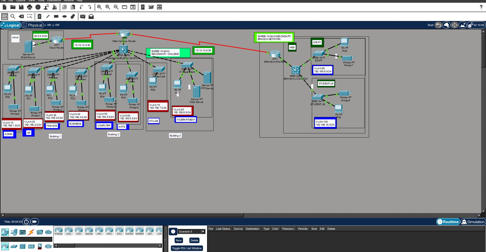
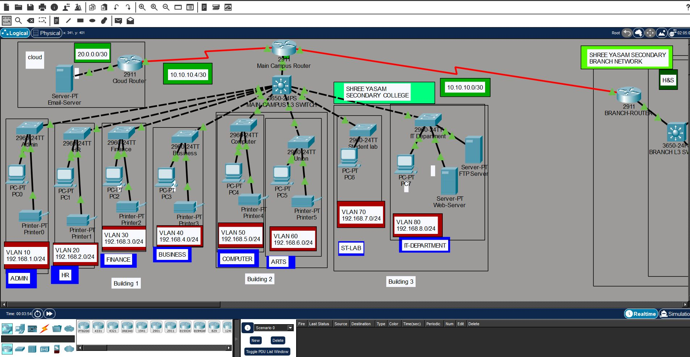
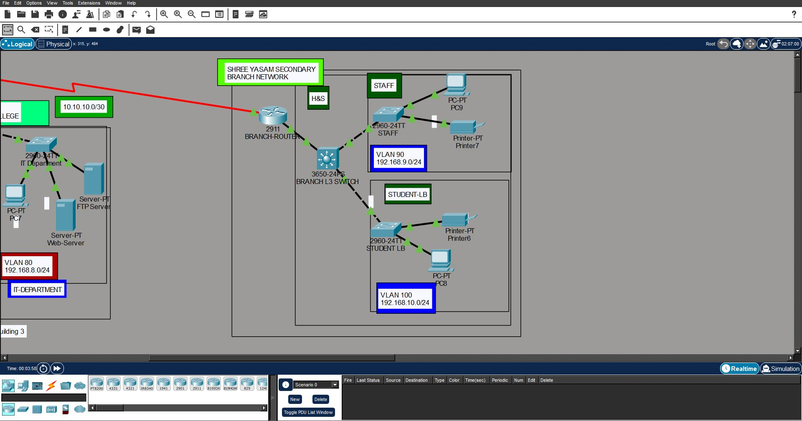

# 🏫 Shree Yasam Secondary College — Campus Network Design

**Cisco Packet Tracer Networking Project**

This project is a simulated **multi-campus network infrastructure design for Shree Yasam Secondary College**, created in Cisco Packet Tracer.

The network was designed around the institution's departmental structure and future networking requirements, with an emphasis on **scalability, network segmentation, centralized services, routing, and secure connectivity between two campuses**.

The project connects administrative departments, academic faculties, student laboratories, IT services, servers, and a branch campus while maintaining separate IP networks for each organizational unit.

---
## 🖼️ Network Topology




## 🗺️ Project Overview

The network consists of:

* **Main Campus**

  * Administrative departments
  * Faculty of Business
  * Faculty of Engineering & Computing
  * Faculty of Art & Design
  * Student computer laboratories
  * IT Department
  * Internal Web and FTP servers

* **Branch Campus**

  * Faculty of Health & Sciences
  * Staff network
  * Student laboratory network

* **External Network**

  * Cloud-hosted Email Server

The two campuses communicate through routed network infrastructure, while internal departments remain logically separated using VLANs.

---

## 🏢 Main Campus Architecture


The Main Campus is divided into three buildings.

### Building 1 — Administration & Business

Provides connectivity for:

* Management
* Human Resources
* Finance
* Faculty of Business

Each department operates within its own VLAN and IP subnet.

### Building 2 — Academic Faculties

Provides connectivity for:

* Faculty of Engineering & Computing
* Faculty of Art & Design

Separate VLANs are used to isolate departmental traffic while Layer 3 switching provides controlled communication between networks.

### Building 3 — Student Labs & IT Department

Contains:

* Student computer laboratories
* IT Department
* Internal Web Server
* Internal FTP Server

Centralized network services are hosted within the IT infrastructure and made accessible to authorized networks across the campus.

---

## 🏥 Branch Campus


The Branch Campus hosts the **Faculty of Health & Sciences**.

Separate networks are provided for:

* Faculty and staff
* Student laboratories

The Branch Campus communicates with the Main Campus using **RIP version 2 dynamic routing**.

---

## ☁️ External Services

An external Email Server is simulated on a cloud-connected network.

Static routing is used to provide communication between the institutional network and the external server.

This demonstrates how an internal campus infrastructure can communicate with services located outside the local network.

---

## 🌐 Network Architecture

The design follows a structured and hierarchical approach.

```text
                       External Cloud
                            |
                       Email Server
                            |
                            |
                      Main Campus Router
                            |
                ---------------------------
                |            |            |
            Building 1   Building 2   Building 3
                |            |            |
            Admin &       Academic      Labs & IT
            Business      Faculties      Servers
                |
                |
          Routed Connection
                |
                |
          Branch Campus Router
                |
        Faculty of Health
          & Sciences
```

---

## ⚙️ Technologies Implemented

### VLAN Segmentation

Separate VLANs are used for different departments and faculties.

This helps:

* Reduce broadcast traffic
* Improve network organization
* Separate departmental traffic
* Improve security and scalability

---

### Inter-VLAN Routing

**Layer 3 switches** provide routing between VLANs.

This allows devices located in different departmental networks to communicate without placing every device inside the same broadcast domain.

---

### IEEE 802.1Q Trunking

Trunk connections transport traffic from multiple VLANs between network switches.

802.1Q VLAN tagging allows the switching infrastructure to identify which VLAN each Ethernet frame belongs to.

---

### DHCP

Router-based DHCP automatically provides client devices with:

* IP addresses
* Subnet masks
* Default gateways
* Other required network configuration

This eliminates the need to manually configure every endpoint.

---

### RIP Version 2

**RIPv2** provides dynamic routing between the Main Campus and Branch Campus.

Routers automatically exchange information about available networks and learn routes to remote campus subnets.

---

### Static Routing

Static routes are used where manually defined network paths are appropriate, including communication with the external server environment.

---

### Switch Security

Switch security configurations are implemented to improve access-layer protection and reduce unauthorized network access.

---

## 🔐 Network Design Principles

The project applies several important network architecture concepts:

* Network segmentation
* Separate departmental subnets
* Hierarchical network design
* Centralized network services
* Dynamic routing
* Controlled external connectivity
* Scalable IP addressing
* Switch-level security
* Multi-campus communication

---

## 🖥️ Centralized Services

The IT Department hosts centralized services used by other parts of the organization.

### Web Server

Provides internal web services to connected campus networks.

### FTP Server

Provides centralized file-transfer functionality.

### External Email Server

Represents an externally hosted email infrastructure accessible through the routed network.

---

## ✅ Connectivity Testing

End-to-end connectivity was tested throughout the topology.

The testing verified communication between:

| Test                             | Result       |
| -------------------------------- | ------------ |
| Devices within the same VLAN     | ✅ Successful |
| Devices across different VLANs   | ✅ Successful |
| Main Campus ↔ Branch Campus      | ✅ Successful |
| Departments ↔ Internal Servers   | ✅ Successful |
| Campus Network ↔ External Server | ✅ Successful |
| DHCP Client Address Assignment   | ✅ Successful |

These tests confirmed that switching, VLAN segmentation, inter-VLAN routing, routing protocols, and external routing were functioning as intended.

---

## 🛠️ Tools & Technologies

* Cisco Packet Tracer
* Cisco Routers
* Layer 2 Switching
* Layer 3 Switching
* VLANs
* IEEE 802.1Q Trunking
* Inter-VLAN Routing
* DHCP
* RIP Version 2
* Static Routing
* IPv4 Addressing
* Subnetting
* Switch Security
* Network Troubleshooting

---

## 🧠 Skills Demonstrated

This project demonstrates practical experience with:

* Campus network architecture
* Enterprise-style network segmentation
* VLAN planning and configuration
* IP addressing and subnet design
* Layer 2 and Layer 3 switching
* Inter-VLAN routing
* Dynamic routing protocols
* Static route configuration
* DHCP deployment
* Server connectivity
* Multi-campus networking
* Network troubleshooting
* Connectivity verification
* Cisco IOS configuration
* Secure and scalable network design

---

## 📁 Project Files

* `campus network.pkt` — Complete Cisco Packet Tracer project
* `README.md` — Project architecture and technical documentation

To explore the network:

1. Download the `.pkt` file.
2. Install or open **Cisco Packet Tracer**.
3. Open `campus network.pkt`.
4. Review the topology and device configurations.
5. Use Packet Tracer Simulation Mode or device command prompts to test connectivity.

---

## 🎯 Project Purpose

The purpose of this project was not simply to connect devices.

The goal was to understand how a real educational institution could organize a growing network across multiple buildings and campuses while maintaining:

**segmentation, scalability, centralized services, routing, and reliable communication.**

Building the project strengthened my understanding of how VLANs, Layer 3 switching, routing protocols, DHCP, and network security work together as part of a complete network infrastructure.

---

## ⚠️ Disclaimer

This is an **educational network simulation created in Cisco Packet Tracer**.

It demonstrates a proposed network architecture and networking concepts and should not be interpreted as the production network configuration currently deployed by Shree Yasam Secondary College.
